# Reproducing Figure 5 (Tsukui et al. 2020) — v1 Findings and Discrepancies

**Source:** Tsukui et al., *Nature Communications* (2020), "Collagen-producing lung cell atlas identifies multiple subsets with distinct localization and relevance to fibrosis" (GSE132771)
**Figure reproduced:** Figure 5 (a–g)

## Overview

This report documents the first full pass (v1) at reproducing Figure 5 from Tsukui et al. 2020: whole-dataset clustering and annotation (5a–5b), followed by reclustering of the COL1A1+/mesenchymal subset (5c–5g). Two discrepancies were found in the subset-level reproduction (cell count and cluster count), along with the investigation used to explain them and a proposed fix for v2.

## Figure 5a: Whole-dataset clustering

Standard preprocessing (QC filtering, SCTransform, PCA, FastMNN integration across samples) was applied to the full dataset, followed by Louvain clustering and UMAP embedding.

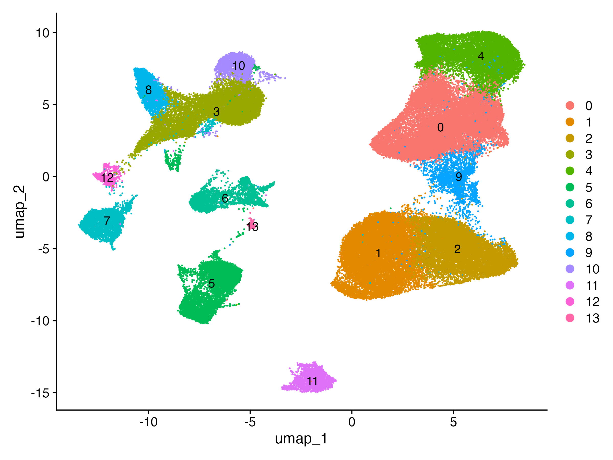
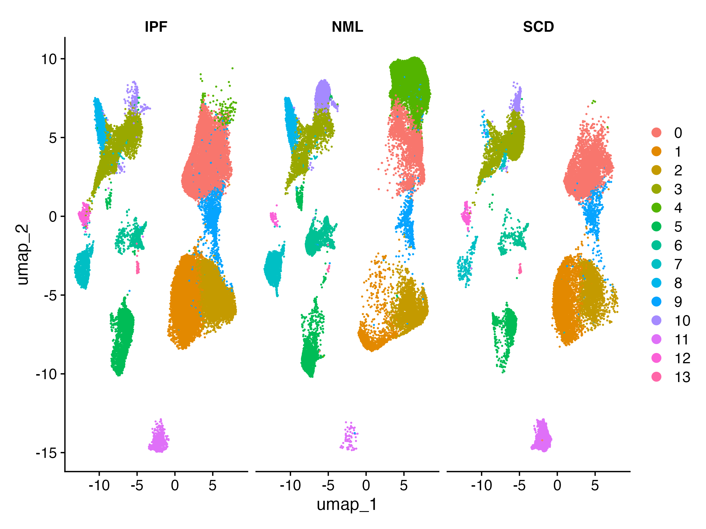

No discrepancies have been identified at this stage as of this report, cluster counts and overall UMAP structure at the whole-dataset level have not yet been directly compared against the published panel in detail.

## Figure 5b: Cell type annotation

Clusters from 5a were annotated using a combination of automatic label transfer (Azimuth) and manual marker-gene review (Cell Maker 3.0).

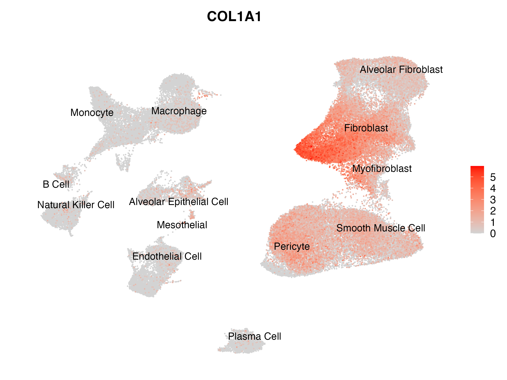

Full whole-dataset annotation output, for reference:

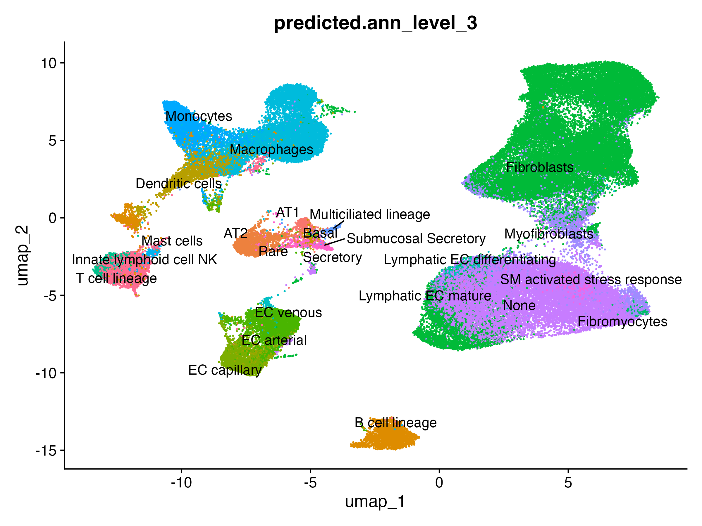
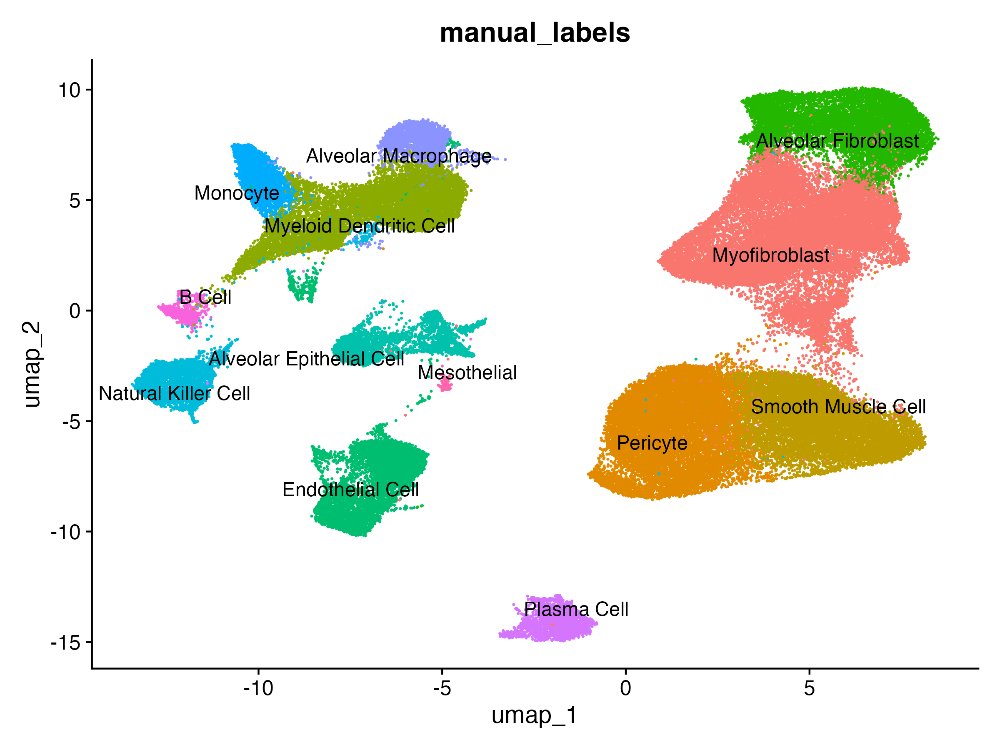
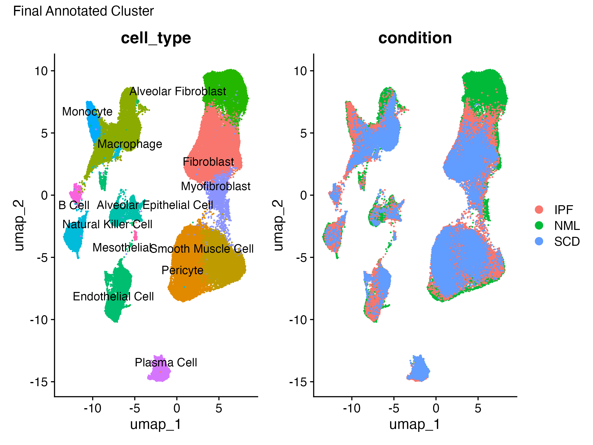

## Summary of discrepancies (Figures 5c–5g)

The COL1A1+/mesenchymal subset was isolated from the `_Lin` samples for reclustering (Figure 5c–5g). Two discrepancies emerged at this stage:

| Metric | This reproduction (v1) | Published | Difference |
|---|---|---|---|
| COL1A1+ subset cell count | 25,782 | 48,587 | ~47% fewer |
| Clusters recovered | 9 | 7 | 2 extra |

## Discrepancy 1: Cell count

The COL1A1+ subset used for reclustering in v1 was defined by a raw RNA expression threshold (`COL1A1 > 0` within the `_Lin` samples), yielding 25,782 cells, roughly half the paper's reported 48,587.

**Hypothesis A — SCT-corrected vs. raw expression.** Dropout in raw scRNA-seq counts could cause an expression-threshold filter to undercount true COL1A1+ cells. I re-applied the same threshold to SCT-corrected values instead of raw counts.

- Raw RNA-based subset: 25,782 cells
- SCT-corrected subset: 26,043 cells
- Difference: ~1%

This rules out dropout correction as the explanation — the two thresholds are nearly identical, so *how* COL1A1 expression is measured isn't the source of the gap.

**Hypothesis B — cell-type/cluster-based definition.** no expression cutoff at all; the reported count is cell-type count within `_Lin` samples.** I tested whether the paper never applied a per-cell COL1A1 expression threshold, and the reported ~48,587 cells are simply every cell within the `_Lin` samples that was already annotated (via whole-dataset clustering) as one of the known collagen-producing cell types:

- Result: 49,338 cells (drawn from `_Lin` samples only)
- Published: 48,587 cells
- Difference: ~1.5%

## Discrepancy 2: Cluster count

Reclustering the v1 (RNA-threshold) COL1A1+ subset produced 9 clusters, compared to 7 in the published figure.

**Cluster 7 — resolved as Mesothelial.** 

Chosen ident.2 to be cluster 0, 2 and 5 as it is closest to the cluster 7

```r
cluster7_markers <- FindMarkers(merged_lin_col1a1_2, ident.1 = "7", ident.2 = c("0", "2", "5"))
head(cluster7_markers[order(-cluster7_markers$avg_log2FC), ], 20)
```

Results: 
1. Epithelial/Secretory: BPIFA1 (1.6%), ITLN1 (29.1%), AGR2 (20.5%), PVPRL4 (4.9%), SPINK1 (5.5%), RAB17 (6.2%), EPGN (3.6%), SERPINB4 (3.9%)
2. Endothelial: SOX17 (3.4%), PLVAP (4.2%), PTPRB (2.9%), CCL14 (3.1%), FGG (1.6%)
3. Immune Cell: GIMAP7 (4.9%), HCST (8.6%), MS4A7 (8.3%)

Conclusion: The list splits cleanly into three categories without a connecting theme, and calculated the numer of cells within each cell_type which resulted in 36% being Alveolar Epithelial Cell and 31% are Mesothelial cells.

**Cluster 8 — likely technical/batch artifact.** Sample composition and QC investigation:

```r
table(merged_lin_col1a1$orig.ident, merged_lin_col1a1$seurat_clusters)
```

showed cluster 8 was overwhelmingly composed of cells from a single donor/sample.

**Conclusion:** cluster 8 is most likely a single-donor batch/integration artifact rather than a true biological population. This remains unresolved and is flagged as an open item below rather than a confirmed explanation.

## Proposed resolution for v2

1. Redefine the Figure 5 subset using the cell-type-based gate (Hypothesis B above: `cell_type %in% mesenchymal_types`) instead of the raw/corrected RNA expression threshold on `COL1A1`.
2. Re-run the full reclustering pipeline (SCTransform → PCA → FastMNN integration → clustering → UMAP) on this ~48,145-cell subset.
3. Re-evaluate whether cluster 8 persists on the corrected subset. This may resolve on its own if it was an artifact of the smaller, threshold-based subset's integration — but this is not guaranteed and should be checked rather than assumed.

## Figures 5c–5g

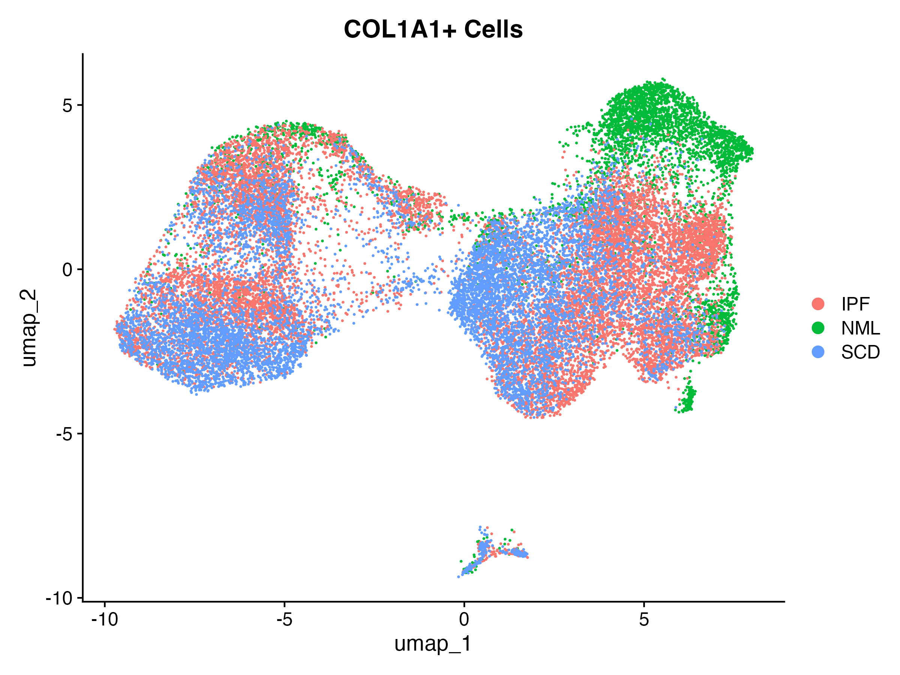
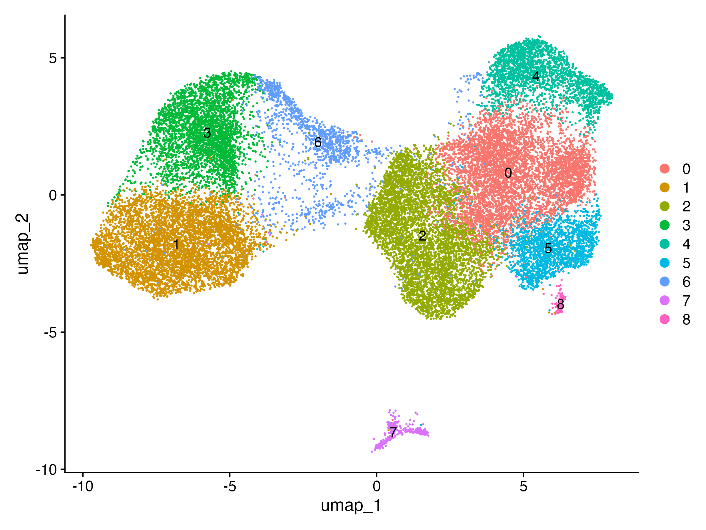
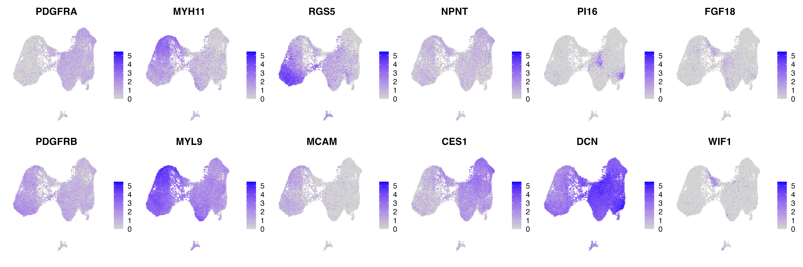
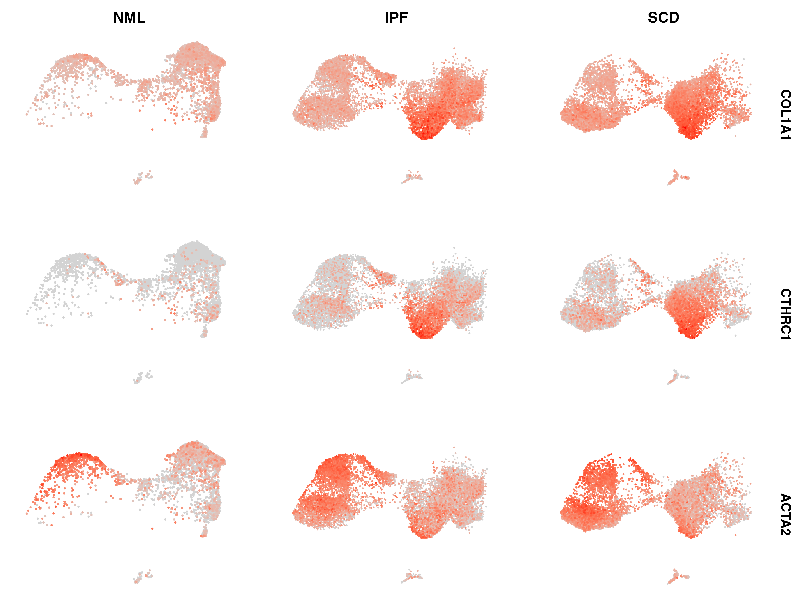
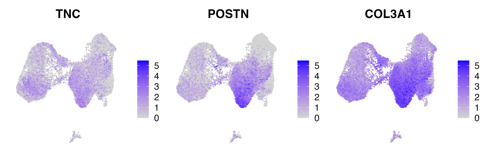

## Known limitations

- Cluster 8's identity remains unresolved; "single-donor artifact" is the best-supported explanation given current evidence but has not been independently confirmed.
- Whole-dataset clustering/annotation (5a–5b) has not yet been directly compared against the published figure for discrepancies — only the COL1A1+ subset stage (5c–5g) has been investigated in detail.
- The paper's methods section does not explicitly state how the Figure 5 subset was defined
- v2 (cell-type-gated subset) has not yet been run through the full reclustering pipeline as of this report.